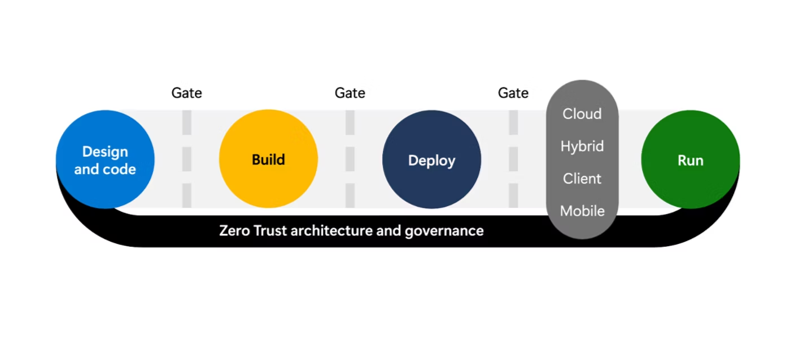

# Overview

The Security Development Lifecycle (SDL) is a set of practices and tools that help developers build more secure software, by integrating security protections into the development pipeline. These are the 10 key security practices of the SDL that help integrate security into each stage of the overall development process.

Security risks (and the need to mitigate them) can occur at any point in the development lifecycle:

- Design – ensure that the design doesn’t naturally allow attackers to easily gain unauthorized access to the workload, its data, or other business assets in the organization.
- Code – ensure that writing (and re-use) of code doesn’t allow attackers to easily take control of the application to perform unauthorized actions that harm customers, employees, systems, data, or other business assets. Developers should also work in a secure environment that doesn’t allow attackers to do this without their knowledge.
- Build and Deploy – ensure that the continuous integration and continuous deployment (CI/CD) processes don’t allow unauthorized users to alter the code and allow attackers to compromise it.
- Run – ensure that environment running the code (cloud, servers, mobile devices, others) follows security best practices across people, process, and technology to avoid attackers compromising and abusing the workload. This includes the adoption of well-established best practices, security baseline configurations, and more.
- Zero Trust architecture and governance – All of these stages should follow Zero Trust principles to assume breach (assume compromise), explicitly verify trust, and grant the least privilege required for each user account, machine/service identity, and application component.

## Establish Standards, Metrics & Governance

- Standards are outlined in this document
- Metrics from tooling must be centrally monitored & acted upon as a first-class citizen
- Regular compliance reporting to highlight areas of concern

## Require use of proven security features, languages & frameworks

- Use managed identities were possible
- Use well-known authentication methods (minted JWT's, OAuth2.0, OIDC)
- Use well-known secure stores, such as Azure Key-Vault
- Use Standard libraries, such as MSAL
- Enforce least privilege

## Preform a security design review & threat modelling

- Security Design Review is performed as part of ARB, as-is reviews & in the design process
- Threat modelling must be performed during the design process

## Define & Use Cryptography Standards

- Only use the current gold-standard encryption methods
  - Symmetric: AES-256
  - Asymmetric: RSA-4096
- All data must be encrypted in transit using TLS 1.2+
- Encrypt sensitive data at rest
- Encryption Agility - Encryption mechanisms must be able to be upgraded
- Regular Key & Secret Rotation

## Secure the software supply chain

- SCA/SBOM provided through Dependabot

- [TODO] Open-Source scanning with Snyk

- [TODO] Artifact Attestation

## Secure the engineering environment

- Zero-Trust
- Least Privilege Access

## Perform Security Testing

- [TODO] SAST
- [TODO] DAST
- SCA through Dependabot
- [TODO] Snyk OS Scanning
- [TODO] Pen Testing

## Ensure Operational Platform Security

- Enforce MFA
- Automate Patching
- Protect Admin Accounts
- Utilise RBAC with Least Privilege and JIT access
- DDoS protection

## Implement Security Monitoring & Response

- [TODO] Monitoring through App Insights
- [TODO] XDR
- [TODO] Establish security incident response process

## Provide Security Training

- [OWASP Top 10](https://learn.snyk.io/learning-paths/owasp-top-10/)

- [Snyk Top 10](https://learn.snyk.io/learning-paths/snyk-top-10/)

- [Security For Developers](https://learn.snyk.io/learning-paths/security-for-developers/)

- [What Is PII?](https://learn.snyk.io/lesson/what-is-pii/)